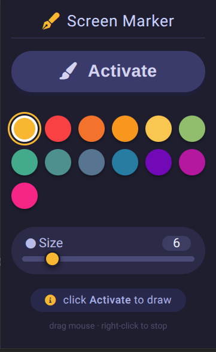

# 🖊️ Screen Marker

یک افزونه ساده برای Chrome که به شما اجازه می‌دهد روی هر صفحه وب با ماوس نقاشی و علامت‌گذاری کنید.



## ⚙️ نصب

1. این پروژه را دانلود یا Clone کنید.

2. در Chrome وارد صفحه زیر شوید:

   `chrome://extensions/`

3. گزینه **Developer mode** را از بالای صفحه فعال کنید.

4. روی **Load unpacked** کلیک کنید.

5. پوشه پروژه را انتخاب کنید.

افزونه نصب شده و آیکون **Screen Marker** در قسمت Extensions نمایش داده می‌شود.

## 🖌️ نحوه استفاده

1. وارد صفحه‌ای شوید که می‌خواهید روی آن علامت بزنید.
2. روی آیکون **Screen Marker** کلیک کنید.
3. رنگ موردنظر خود را انتخاب کنید.
4. اندازه قلم را با اسلایدر تنظیم کنید.
5. روی **Activate** کلیک کنید.
6. با نگه داشتن کلیک چپ و حرکت دادن ماوس روی صفحه نقاشی کنید.

برای توقف نقاشی می‌توانید **راست‌کلیک** کنید یا دوباره روی **Deactivate** بزنید.

## 🎨 امکانات

* انتخاب رنگ قلم
* تغییر اندازه قلم
* رسم با ماوس روی صفحات وب
* نمایش نشانگر متناسب با رنگ و اندازه قلم
* فعال و غیرفعال کردن سریع ابزار

## 📁 فایل‌های پروژه

```text
Screen Marker/
├── manifest.json
├── popup.html
├── popup.js
├── content.js
└── screenshot.png
```

## 📝 نکته

اگر افزونه روی یک صفحه کار نکرد، صفحه را یک‌بار Refresh کنید و دوباره افزونه را فعال کنید.
